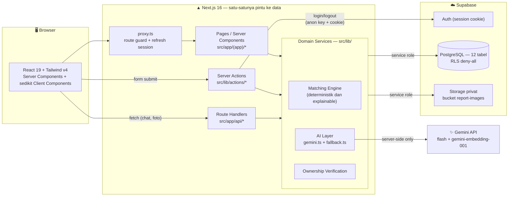
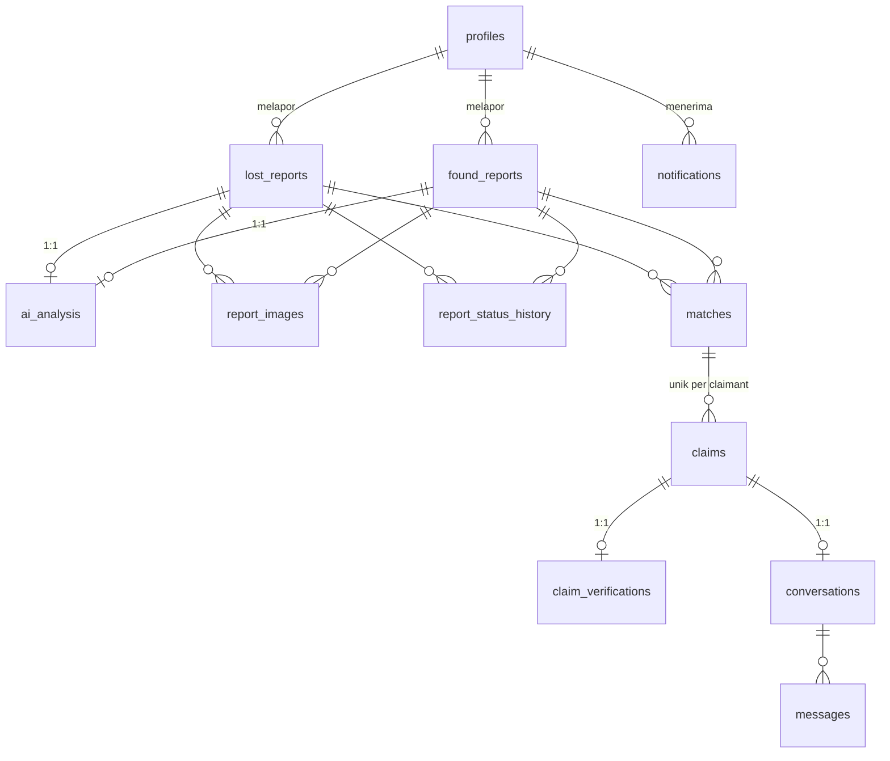
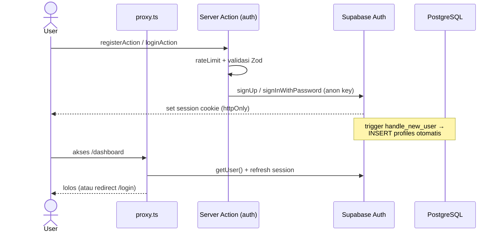
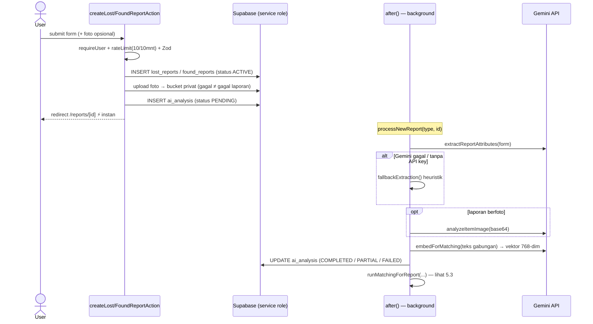
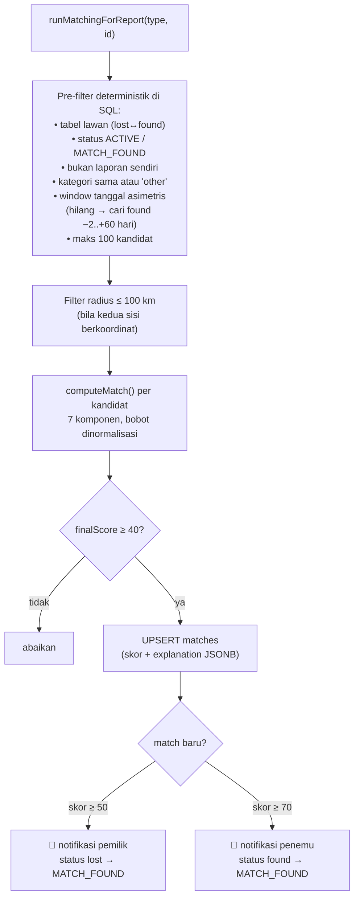
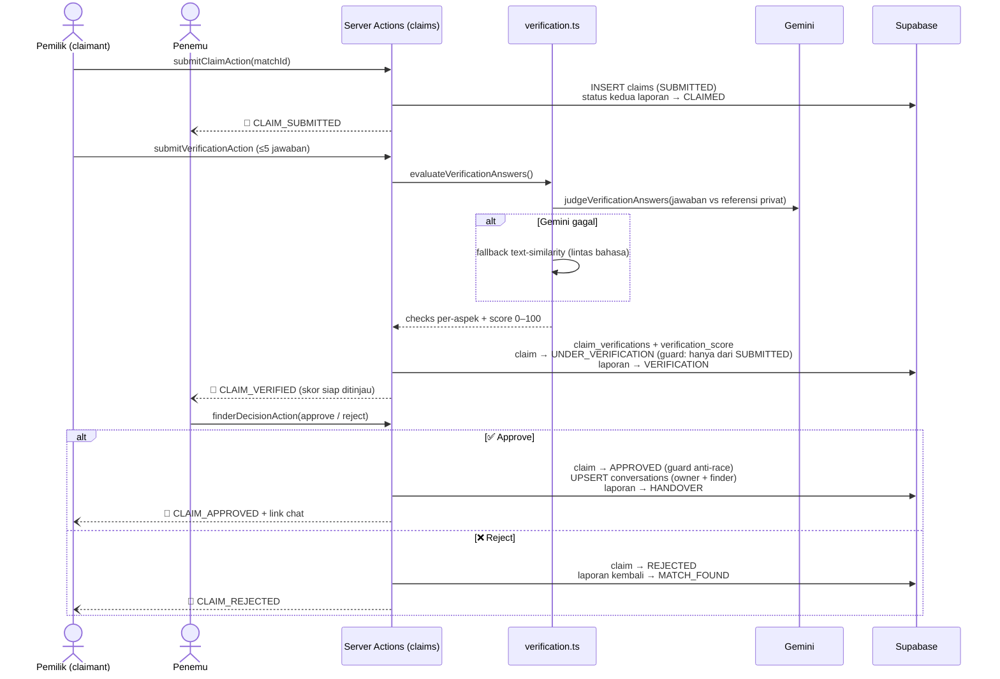
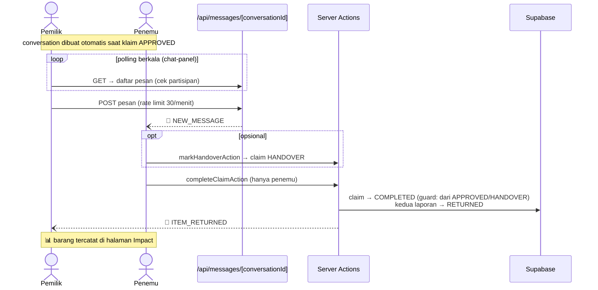
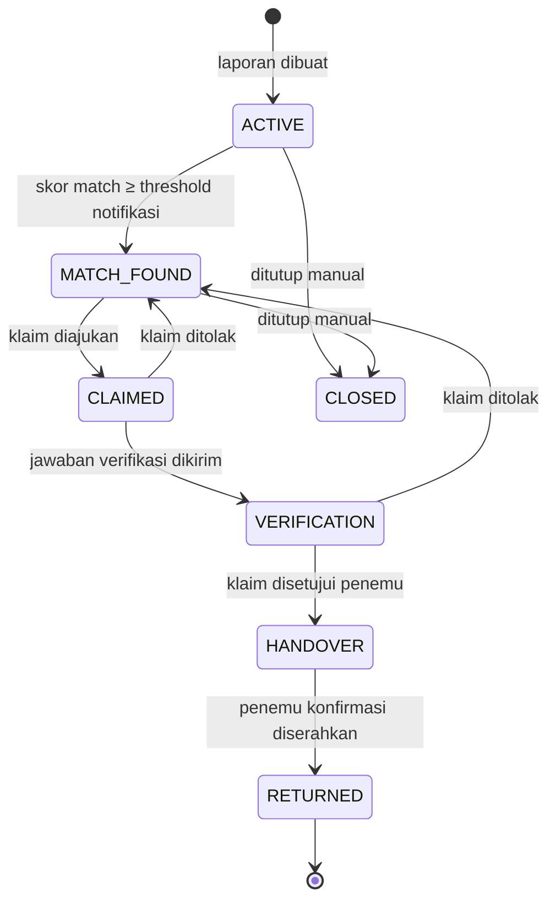
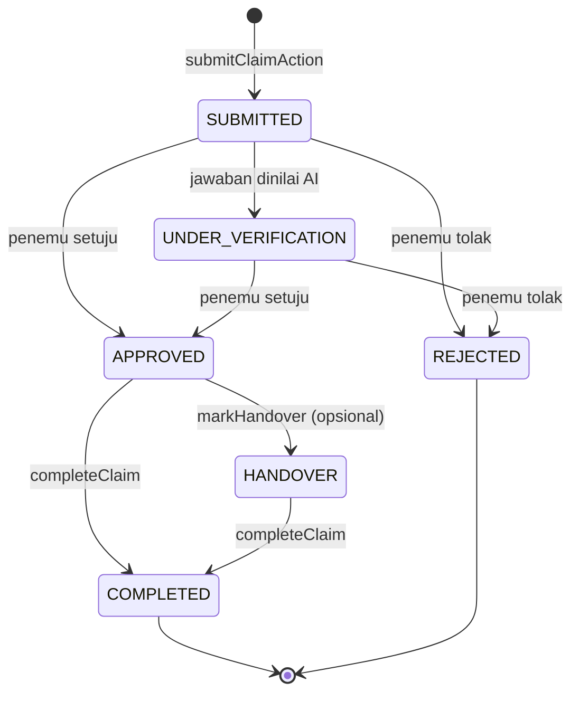

# 🏗️ Arsitektur & Flow Sistem — Temuin

Dokumen ini menjelaskan arsitektur teknis dan alur kerja **Temuin**, platform Lost & Found bertenaga AI. Untuk gambaran produk & cara setup, lihat [README utama](../README.md).

## Daftar Isi

1. [Gambaran Umum](#1-gambaran-umum)
2. [Struktur Direktori](#2-struktur-direktori)
3. [Lapisan Aplikasi](#3-lapisan-aplikasi)
4. [Skema Database](#4-skema-database)
5. [Flow Sistem](#5-flow-sistem)
6. [Siklus Status](#6-siklus-status)
7. [Model Keamanan](#7-model-keamanan)
8. [Graceful Degradation](#8-graceful-degradation)

---

## 1. Gambaran Umum

Temuin adalah aplikasi **full-stack Next.js 16 (App Router)** — frontend dan backend hidup dalam satu codebase. Seluruh akses data dan AI berjalan **hanya di server**; browser tidak pernah memegang kredensial database maupun API key AI.



**Prinsip desain utama:**

| Prinsip | Implementasi |
| --- | --- |
| Zero-trust ke browser | RLS **deny-all** di semua tabel; data hanya lewat backend (service role) dengan ownership check per-request |
| AI sebagai sinyal, bukan hakim | Gemini hanya menyuplai ekstraksi/embedding/analisis foto; skor akhir dihitung **deterministik** oleh Matching Engine |
| Non-blocking UX | Laporan tersimpan instan; AI & matching jalan di background via `after()` |
| Selalu berfungsi | Setiap fungsi AI punya fallback heuristik lokal (termasuk kamus ID→EN) |
| Explainable | Skor match disimpan per-komponen (`explanation` JSONB) dan ditampilkan ke user |

## 2. Struktur Direktori

```
src/
├── proxy.ts                  # Route guard (pengganti middleware di Next 16):
│                             #   refresh session + redirect login/dashboard
├── app/
│   ├── page.tsx              # Landing page (publik)
│   ├── login/  register/     # Halaman autentikasi
│   ├── (app)/                # Route group terautentikasi (dilindungi proxy)
│   │   ├── dashboard/        # Ringkasan laporan, match, notifikasi
│   │   ├── report/lost/      # Form laporan kehilangan
│   │   ├── report/found/     # Form laporan penemuan
│   │   ├── reports/[id]/     # Detail laporan + status AI + timeline
│   │   ├── matches/[id]/     # Detail match + breakdown skor
│   │   ├── claims/[id]/      # Alur klaim & verifikasi
│   │   ├── messages/[id]/    # Chat aman per-conversation
│   │   ├── notifications/    # Daftar notifikasi
│   │   ├── impact/           # Statistik barang yang kembali
│   │   ├── profile/          # Edit profil & password
│   │   └── admin/            # Panel admin (role-gated)
│   └── api/
│       ├── images/           # GET foto privat via signed URL (authz per-request)
│       ├── messages/[conversationId]/  # GET (polling) + POST pesan chat
│       └── dev/seed/         # Seed data demo (dikunci SEED_SECRET)
├── components/               # UI: app-shell, report-form, chat-panel,
│                             #     score-breakdown, status-timeline, dll.
└── lib/
    ├── actions/              # SERVER ACTIONS — semua mutasi data
    │   ├── auth.ts           #   register, login, logout
    │   ├── reports.ts        #   create lost/found, retry AI, close report
    │   ├── claims.ts         #   submit claim, verifikasi, keputusan penemu,
    │   │                     #   handover, complete
    │   └── profile.ts        #   update profil, ganti password
    ├── ai/
    │   ├── gemini.ts         # Integrasi Gemini (4 fungsi, server-only)
    │   └── fallback.ts       # Heuristik non-AI + kamus token ID→EN
    ├── matching/
    │   ├── engine.ts         # computeMatch() — skor deterministik 7 komponen
    │   └── run.ts            # Pipeline: processReportAI() + runMatchingForReport()
    ├── supabase/
    │   ├── server.ts         # Client anon + cookie — KHUSUS autentikasi
    │   └── admin.ts          # Client service-role — semua akses data
    ├── auth.ts               # getSessionUser / requireUser / getProfile
    ├── verification.ts       # Pertanyaan verifikasi + penilaian jawaban
    ├── claims.ts / matches.ts / reports.ts / notifications.ts  # Query helpers
    ├── validation.ts         # Skema Zod semua input
    ├── rate-limit.ts         # Rate limiter in-memory
    ├── constants.ts          # Bobot, threshold, kategori, meta status
    ├── types.ts              # Tipe domain bersama
    └── utils.ts              # haversine, cosine, text similarity, format
supabase/
├── schema.sql                # 12 tabel + enum + trigger + RLS + bucket
└── migrations/               # CHECK constraints tambahan
```

## 3. Lapisan Aplikasi

### 3.1 Proxy (route guard)

[`src/proxy.ts`](../src/proxy.ts) berjalan di setiap request halaman (pengganti `middleware.ts` pada Next 16):

1. Me-refresh session Supabase bila kedaluwarsa (sinkronisasi cookie).
2. Redirect ke `/login?next=...` bila user belum login mengakses prefix terproteksi (`/dashboard`, `/report`, `/reports`, `/matches`, `/claims`, `/notifications`, `/impact`, `/profile`, `/messages`, `/admin`).
3. Redirect user yang sudah login dari `/login` & `/register` ke `/dashboard`.

Halaman terproteksi tetap memanggil `requireUser()` sebagai lapisan kedua — proxy hanyalah gerbang pertama.

### 3.2 Dua client Supabase (pemisahan peran)

| Client | File | Kunci | Kegunaan |
| --- | --- | --- | --- |
| **Server (anon + cookie)** | [`lib/supabase/server.ts`](../src/lib/supabase/server.ts) | `NEXT_PUBLIC_SUPABASE_ANON_KEY` | **Hanya autentikasi** — login, logout, ganti password, baca session |
| **Admin (service role)** | [`lib/supabase/admin.ts`](../src/lib/supabase/admin.ts) | `SUPABASE_SERVICE_ROLE_KEY` | **Semua akses data & storage** — bypass RLS, wajib disertai ownership check di kode |

Karena semua tabel RLS deny-all, anon key tidak bisa membaca data apa pun — bahkan bila bocor ke browser.

### 3.3 Server Actions (semua mutasi)

Setiap action mengikuti pola yang sama:

```
requireUser() → rateLimit() → validasi Zod → authz/ownership check
→ mutasi via supabaseAdmin() → catat history/notifikasi → revalidatePath()
```

| Action | Rate limit | Fungsi |
| --- | --- | --- |
| `createLostReportAction` / `createFoundReportAction` | 10 / 10 menit | Simpan laporan + upload foto + jadwalkan pipeline AI |
| `retryAiAction` | — | Ulangi pipeline AI bila gagal |
| `closeReportAction` | — | Tutup laporan manual |
| `submitClaimAction` | 10 / 10 menit | Ajukan klaim atas sebuah match |
| `submitVerificationAction` | 8 / 10 menit | Kirim jawaban verifikasi → dinilai AI |
| `finderDecisionAction` | — | Penemu menyetujui / menolak klaim |
| `markHandoverAction` / `completeClaimAction` | — | Serah terima & konfirmasi selesai |
| `loginAction` / `registerAction` | ada | Autentikasi |

### 3.4 Route Handlers (API)

| Endpoint | Metode | Fungsi |
| --- | --- | --- |
| `/api/images?type=&id=` | GET | Authz per-request (pemilik / lawan match / admin) → redirect ke **signed URL** berumur 300 detik dari bucket privat |
| `/api/messages/[conversationId]` | GET | Ambil pesan (dipolling client); hanya untuk partisipan conversation |
| `/api/messages/[conversationId]` | POST | Kirim pesan (rate limit 30/menit) + notifikasi `NEW_MESSAGE` |
| `/api/dev/seed?secret=` | GET/POST | Seed data demo melalui pipeline AI asli; dikunci `SEED_SECRET` |

### 3.5 AI Layer

[`lib/ai/gemini.ts`](../src/lib/ai/gemini.ts) — semua fungsi **mengembalikan `null` saat gagal** (timeout 30 detik) sehingga pemanggil wajib pakai fallback:

| Fungsi | Model | Output |
| --- | --- | --- |
| `extractReportAttributes` | `GEMINI_MODEL` (default `gemini-flash-latest`) | JSON terstruktur: item_type, warna, merek, material, ciri khusus, keywords, deskripsi ternormalisasi (EN) |
| `analyzeItemImage` | sama | Analisis foto: objek, warna, merek, ciri pembeda |
| `embedForMatching` | `gemini-embedding-001` | Vektor 768-dim, L2-normalized |
| `judgeVerificationAnswers` | sama dgn extraction | Verdict per jawaban: `match` / `partial` / `no_match` / `unknown` + catatan |

[`lib/ai/fallback.ts`](../src/lib/ai/fallback.ts) — ekstraksi heuristik + `translateTokens()` (kamus Indonesia→Inggris) agar laporan berbahasa campuran tetap bisa dibandingkan tanpa AI.

### 3.6 Matching Engine

[`lib/matching/engine.ts`](../src/lib/matching/engine.ts) — `computeMatch()` menghitung 7 komponen skor. **Bobot komponen yang datanya tidak tersedia dikeluarkan, sisanya dinormalisasi ulang ke 100%** — user tanpa foto/koordinat tidak dirugikan.

| Komponen | Bobot dasar | Cara hitung |
| --- | --- | --- |
| Kemiripan deskripsi (semantic) | 30 | Cosine similarity embedding, dipetakan `(cos − 0.55) / 0.37`; fallback: token similarity lintas bahasa |
| Atribut barang | 20 | Rata-rata kecocokan warna/merek/material/model (prioritas: ekstraksi AI → analisis foto → field mentah) |
| Ciri khusus | 10 | Kemiripan teks antar daftar ciri unik kedua sisi |
| Lokasi | 20 | Jarak haversine berjenjang (≤100 m = 1.0 … >25 km = 0.05); fallback: kemiripan nama lokasi |
| Waktu | 15 | Selisih jam hilang↔ditemukan berjenjang (≤2 jam = 1.0 … >30 hari = 0.05); ditemukan >24 jam **sebelum** hilang = 0.05 |
| Kategori | 5 | Sama persis = 1.0; jenis serupa dari AI = 0.9 |
| Foto | 15 | Perbandingan hasil analisis foto kedua sisi (objek 30%, warna 25%, ciri 35%, merek 10%) — hanya bila **kedua** laporan berfoto |

Threshold (di [`lib/constants.ts`](../src/lib/constants.ts)):

| Nilai | Arti |
| --- | --- |
| `finalScore ≥ 40` | Match disimpan ke tabel `matches` |
| `≥ 50` | Notifikasi ke pemilik laporan hilang, status → `MATCH_FOUND` |
| `≥ 70` | Notifikasi juga ke penemu |
| Level | `HIGH ≥ 85` · `GOOD ≥ 70` · `POSSIBLE ≥ 50` · `LOW < 50` |

## 4. Skema Database

12 tabel PostgreSQL (lihat [`supabase/schema.sql`](../supabase/schema.sql)), semuanya RLS deny-all:



| Tabel | Peran | Catatan penting |
| --- | --- | --- |
| `profiles` | Data user + role (`user`/`admin`) | Auto-dibuat trigger `handle_new_user` saat register; `phone` privat |
| `lost_reports` / `found_reports` | Laporan kehilangan / penemuan | `found_reports.private_verification_info` = **rahasia**, tak pernah dikirim ke pengklaim; foto opsional |
| `report_images` | Path foto di bucket privat | XOR constraint: milik lost **atau** found |
| `ai_analysis` | Hasil pipeline AI per laporan (1:1) | `extraction`, `image_analysis`, `embedding` (JSONB); `source` gemini/fallback; `status` PENDING/COMPLETED/PARTIAL/FAILED |
| `matches` | Pasangan lost↔found + skor | Unik `(lost, found)`; skor per-komponen + `explanation` JSONB (explainable) |
| `claims` | Klaim kepemilikan atas match | Unik `(match, claimant)`; `verification_score` |
| `claim_verifications` | Jawaban & hasil penilaian (1:1 klaim) | `checks` per-aspek; `evaluated_by` gemini/fallback |
| `conversations` / `messages` | Chat aman pasca-approve (1:1 klaim) | Hanya owner & finder |
| `notifications` | Notifikasi in-app | MATCH_FOUND, CLAIM_*, NEW_MESSAGE, ITEM_RETURNED, … |
| `report_status_history` | Timeline status laporan | Sumber data komponen status-timeline |

Semua tabel bermutasi memakai trigger `set_updated_at`. Storage: bucket **privat** `report-images`.

## 5. Flow Sistem

### 5.1 Autentikasi



### 5.2 Pembuatan laporan + pipeline AI (non-blocking)

Laporan tersimpan dan user langsung diarahkan ke halaman detail; AI berjalan **setelah response terkirim** memakai `after()` dari `next/server`.



Halaman detail menampilkan status "sedang dianalisis" dari baris `ai_analysis` PENDING; bila FAILED tersedia tombol **Retry** (`retryAiAction`).

### 5.3 Matching



Matching berjalan dua arah: laporan baru dicocokkan ke semua laporan lawan yang sudah ada, sehingga match tetap ditemukan tak peduli mana yang dibuat lebih dulu.

### 5.4 Klaim & verifikasi kepemilikan



**Pertanyaan verifikasi** (bobot dinormalisasi terhadap yang tampil; pertanyaan merek hanya muncul bila penemu mengisi merek/model):

| Aspek | Bobot | Dibandingkan dengan |
| --- | --- | --- |
| Detail privat | 35 | `private_verification_info` (rahasia penemu) |
| Ciri khusus | 25 | `unique_features` + deskripsi penemu |
| Merek / model | 15 | field merek & model |
| Lokasi | 15 | `location_name` penemu |
| Waktu | 10 | tanggal & jam ditemukan |

Skor = Σ(bobot × nilai verdict) → `match` = 1 · `partial` = 0.5 · `unknown` = 0.35 (netral, referensi kurang) · `no_match` = 0. Rekomendasi UI: **≥ 70** kemungkinan besar pemilik sah · **40–69** perlu peninjauan manual · **< 40** kecocokan rendah. **Keputusan akhir selalu di tangan penemu** — AI hanya memberi rekomendasi.

### 5.5 Chat aman & serah terima



### 5.6 Penyajian foto privat

Foto tidak pernah publik. `next/image` menunjuk ke `/api/images?type=lost|found&id=...`, yang:

1. Memastikan user login.
2. Mengizinkan hanya: **pemilik laporan**, **pemilik laporan lawan pada match yang melibatkan laporan itu**, atau **admin**.
3. Membuat **signed URL 300 detik** dari bucket privat, lalu redirect.

## 6. Siklus Status

### Status laporan (lost & found bergerak bersama)



### Status klaim



Setiap transisi klaim memakai **conditional guard** di query (`.eq("status", ...)` / `.in("status", [...])`) sehingga aman dari race condition & double-submit. Semua perubahan status laporan dicatat ke `report_status_history` (sumber timeline di UI).

## 7. Model Keamanan

Pertahanan berlapis, dari luar ke dalam:

| Lapisan | Mekanisme |
| --- | --- |
| 1. Proxy | Redirect user anonim dari semua route terproteksi |
| 2. Session | `requireUser()` di setiap page & server action (lapisan kedua) |
| 3. Rate limit | In-memory per user+aksi: laporan 10/10mnt, klaim 10/10mnt, verifikasi 8/10mnt, chat 30/mnt, login/register |
| 4. Validasi input | Zod server-side di semua action (termasuk rentang lat/long) + CHECK constraint DB |
| 5. Authorization | Ownership check eksplisit per-request sebelum tiap query service-role |
| 6. RLS deny-all | Jika ada bug di lapisan atas, akses langsung DB dari browser tetap ditolak |
| 7. Data rahasia | `private_verification_info` tak pernah dikirim ke pengklaim; foto via signed URL 300 detik; `phone` tak pernah tampil ke user lain |
| 8. Secrets | `GEMINI_API_KEY` & `SUPABASE_SERVICE_ROLE_KEY` hanya di env server — tak pernah masuk bundle browser |
| 9. Anti-race | Conditional guard di semua transisi status |

## 8. Graceful Degradation

Aplikasi dirancang tetap berfungsi penuh **tanpa** `GEMINI_API_KEY` (atau saat Gemini error/timeout):

| Kapabilitas | Dengan Gemini | Tanpa Gemini (fallback) |
| --- | --- | --- |
| Ekstraksi atribut | LLM → JSON terstruktur (normalisasi EN) | Heuristik + kamus token ID→EN |
| Kemiripan deskripsi | Embedding 768-dim + cosine | Token similarity lintas bahasa |
| Analisis foto | Vision → objek/warna/ciri | Komponen foto dinonaktifkan, bobot dinormalisasi ulang |
| Penilaian verifikasi | LLM judge per-aspek + catatan | Text similarity per-aspek |
| Status tercatat | `source: "gemini"` | `source: "fallback"` + tombol Retry |

Kegagalan parsial (mis. embedding sukses tapi analisis foto gagal) menghasilkan status `PARTIAL` — sistem memakai sinyal yang tersedia dan menormalisasi ulang bobot skor.

---

<div align="center">

Kembali ke [README utama](../README.md) · Setup admin: [ADMIN_SETUP.md](ADMIN_SETUP.md)

</div>
